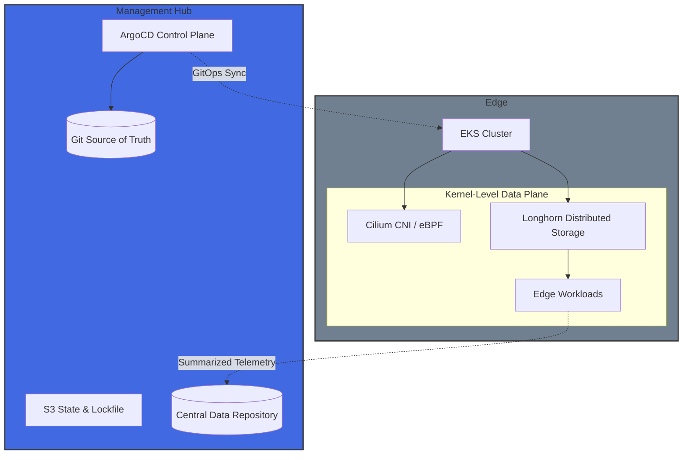

**Edge-First Infrastructure (EFI)** is a reference architecture for geographically distributed workloads. It addresses the trade-offs between centralized cloud management and low-latency edge execution. Compute should reside where the data is born. Control should reside where the humans are.

---

## 🏗 The Architecture

EFI implements a **Hub-and-Spoke** topology across multiple AWS regions, designed to satisfy three core pillars:

1.  **Autonomous Survivability:** Edge nodes must continue to process local data and maintain state even during a total hub outage.
2.  **Kernel-Level Security:** Leveraging **eBPF (Cilium)** to replace `iptables` and sidecar-heavy service meshes with near-zero overhead networking and identity-aware security.
3.  **Declarative Consistency:** Every piece is governed by **GitOps (ArgoCD)**, ensuring no configuration drift across the global fleet.

---

## 🛠 The Tech Stack & "The Why"

| Component          | Choice            | Justification                                                                               |
| :----------------- | :---------------- | :------------------------------------------------------------------------------------------ |
| **Cloud Provider** | **AWS**           | Utilizing Multi-Region VPCs and EKS for managed control plane stability.                    |
| **Networking**     | **Cilium (eBPF)** | High-throughput, low-latency routing; kernel-level observability (Hubble) without sidecars. |
| **Storage**        | **Longhorn**      | Cloud-native distributed block storage that ensures data persistence at the edge.           |
| **Automation**     | **Terraform**     | Modular, multi-region IaC using S3-native state locking.                                    |
| **GitOps**         | **ArgoCD**        | Managing multi-cluster applications via the "App-of-Apps" pattern.                          |

---

## 🧩 System Components

### 1. The Management Hub

The "Central Nervous System." It hosts **ArgoCD** and the primary data repository. Responsible for global state monitoring and aggregated telemetry.

### 2. The Edge Node

The "Workhorse." It hosts the high-impact workloads where sub-10ms latency is mandatory. Performs real-time data processing, local state persistence via **Longhorn**, and eBPF-driven workload isolation.
