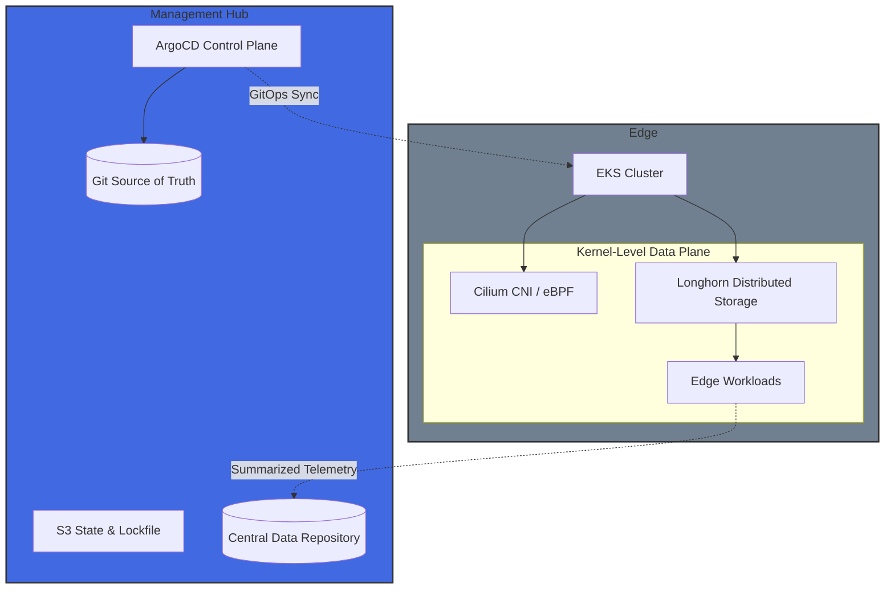

## 📌 Overview

**Edge-First Infrastructure (EFI)** is a reference architecture for geographically distributed workloads. It addresses the trade-offs between centralized cloud management and low-latency edge execution. Compute should reside where the data is born. Control should reside where the humans are.



## 🏗 Architecture

The project is structured into modular layers to ensure a clean separation of concerns between core networking and compute resources.

- **Bootstrap**: Initialized separately to manage S3 backend buckets and OIDC IAM roles.
- **VPC Infra**: Multi-AZ networking with `/20` private subnets optimized for EKS pod density.
- **EKS Infra**: Kubernetes clusters running version **1.35** with **EKS Auto Mode** for managed compute.
- **EKS Platform**: Security configurations including Hybrid access models and specialized SG rules for kubelet connectivity.

---

## 🚀 CI/CD Pipeline Structure

The pipeline uses a parent-child trigger architecture to manage dependencies between the VPC and EKS layers.

### Stages

1.  **Triggers**: Orchestrates the downstream Terraform deployments.
2.  **Lint/Validate**: Ensures HCL quality using `tflint` and `terraform validate`.
3.  **Plan**: Generates execution plans for `staging` and `prod` environments.
4.  **Apply**: Manual or automatic deployment based on the branch (Main vs. Merge Request).
5.  **Destroy**: Scheduled cleanup jobs to manage costs.

---

## 🔐 Security & Identity

### OIDC Authentication

We utilize **GitLab OIDC** to authenticate with AWS without long-lived credentials. The IAM roles are strictly scoped to the repository path: `project_path:evanhermenau/edge-first-infrastructure:*`.

### Cluster Access

EKS access is managed via **Access Entries**, granting `AmazonEKSClusterAdminPolicy` to:

- **The GitLab Runner IAM Role**: Uses the `AWS_ROLE_ARN` provided by the bootstrap process.
- **Designated Admin ARNs**: Defined via `var.admin_user_arn`.
- **Cluster Creator**: Automatic admin permissions enabled for the creating entity.

### Network Hardening

- **Endpoint Access**: Public access is enabled for management, with private access enabled for internal cluster communication.
- **Subnet Isolation**: EKS nodes reside in private subnets, while Load Balancers are managed in public subnets via `kubernetes.io/role/elb` tags.

---

## 🛠 Usage & Local Development

### Prerequisites

- Terraform `~> 1.0`
- AWS CLI & `kubectl`
- GitLab Personal Access Token

### Local Cluster Interaction

To interact with the EKS cluster locally after a CI deployment:

1.  **Update Kubeconfig**:
    ```bash
    aws eks update-kubeconfig --region us-east-1 --name efi-staging-eks-cluster
    ```
2.  **Verify Access**:
    ```bash
    kubectl get nodes
    ```

### Repository Structure

```text
.
├── .gitlab-ci/          # Shared CI templates (Terraform, Destroy)
├── terraform/
│   ├── bootstrap/       # S3 State & IAM OIDC setup
│   ├── vpc-infra/       # Core VPC and Networking
│   └── eks-infra/       # EKS Cluster and Auto Mode config
└── .gitlab-ci.yml       # Parent Pipeline definition

---

## 📜 Architectural Decision Records (ADR)

### ADR 001: Compute Abstraction (Hub vs. Edge)

#### Status: Accepted (2026-02-22)

#### Context:

> We required a compute strategy that balances operational efficiency in the Hub with deep kernel control at the Edge.

#### Decision:

> Management Hub: Implemented using EKS Auto Mode. This offloads the undifferentiated heavy lifting of node scaling, patching, and AMI management to AWS, allowing the focus to remain on global orchestration.

> Edge Nodes: Implement using EKS Managed Node Groups. This provides the necessary access to the underlying Linux kernel required for eBPF (Cilium) and distributed storage (Longhorn) performance tuning.

#### Consequences:

> Reduced operational overhead for the Hub; increased complexity for Edge maintenance is accepted to satisfy security and latency requirements.

---
```
