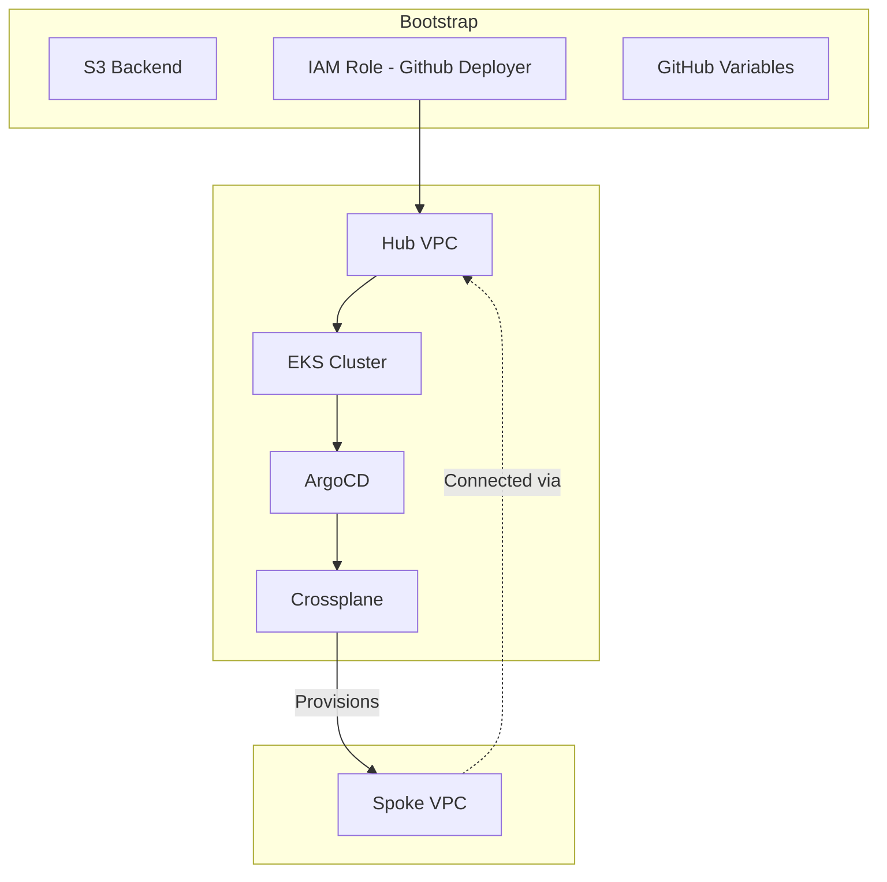

# Edge First Infrastructure (EFI)

[](https://www.terraform.io/)
[](https://aws.amazon.com/)
[](https://about.github.com/)
[](https://kubernetes.io/)
[](https://aws.amazon.com/eks/)

## 📌 Overview

**Edge-First Infrastructure (EFI)** is a reference architecture for geographically distributed workloads. It addresses the trade-offs between centralized cloud management and low-latency edge execution. Compute should reside where the data is born. Control should reside where the humans are.

<details>
<summary>View Architecture Diagram</summary>



</details>

## 🏗 Architecture

The project is structured into modular layers to ensure a clean separation of concerns between core networking and compute resources.

- **Bootstrap**: Initialized separately to manage:
  - S3 backend buckets
  - OIDC IAM roles
  - Github Actions Variables
- **VPC Infra**:
  - Multi-AZ networking
  - Route 53 internal zones
- **EKS Infra**:
  - Kubernetes clusters with **EKS Auto Mode** for managed compute.
- **EKS Platform**:
  - Installs ArgoCD on the EKS cluster, using this repository as its root.

---

## 🚀 Workflow Structure

The pipeline implements a **Promotion-Based Deployment** model to protect production stability:

1.  **Verification Phase (Feature Branches)**:
    - Triggered on every commit to a feature branch.
      - `tflint`, `terraform validate`, and `terraform plan` for **Staging** and **Prod** environments.
    - Triggered on every merge request to the main branch.
      - `tflint`, `terraform validate`, and `terraform plan` for **Staging** and **Prod** environments.
      - Manual `terraform apply` to **Staging** for integration testing.
      - _Production apply is strictly disabled at this stage._

2.  **Promotion Phase (Main Branch)**:
    - Triggered only after a Merge Request is approved and merged.
    - Re-validates the plan against the current `main` state.
    - **Staging Apply**: Runs automatically to ensure the environment is synced.
    - **Prod Apply**: Requires a **Manual Action** in the GitHub UI to execute, serving as the final "sanity check" before pushing to production.

    | Environment        | Trigger Event | Action                 | Flow        | Purpose             |
    | :----------------- | :------------ | :--------------------- | :---------- | :------------------ |
    | **Staging & Prod** | Commit        | tflint, validate, plan | Automatic   | Regression Testing  |
    | **Staging**        | Merge Request | apply                  | Manual Gate | Active Verification |
    | **Staging**        | Merge to Main | apply                  | Automatic   | Environment Sync    |
    | **Production**     | Merge to Main | apply                  | Manual Gate | Controlled Release  |

---

## 🔐 Security & Identity

### OIDC Authentication

We utilize **GitHub OIDC** to authenticate with AWS without long-lived credentials. The IAM roles are strictly scoped to the repository path: `project_path:ehermenau/edge-first-infra:*`.

### Cluster Access

EKS access is managed via **Access Entries**, granting `AmazonEKSClusterAdminPolicy` to:

- **The GitHub Runner IAM Role**: Uses the `AWS_ROLE_ARN` provided by the bootstrap process.
- **Designated Admin ARNs**: Defined via `var.admin_user_arn`.

---

## ✅ Post-Deployment

To interact with the EKS cluster locally after a deployment:

1.  **Update Kubeconfig**:
    ```bash
    aws eks update-kubeconfig --region us-east-1 --name <cluster name>
    ```
2.  **Verify Access**:
    ```bash
    kubectl get nodes
    ```

---

<details>
<summary>Architectural Decision Records</summary>

## 📜 Architectural Decision Records (ADR)

### ADR 001: Compute Abstraction (Hub vs. Edge)

#### Status: Accepted (2026-02-22)

#### Context:

> We required a compute strategy that balances operational efficiency in the Hub with deep kernel control at the Edge.

#### Decision:

> Management Hub: Implemented using EKS Auto Mode. This offloads the undifferentiated heavy lifting of node scaling, patching, and AMI management to AWS, allowing the focus to remain on global orchestration.

> Edge Nodes: Implement using EKS Managed Node Groups. This provides the necessary access to the underlying Linux kernel required for eBPF (Cilium) and distributed storage (Longhorn) performance tuning.

#### Consequences:

> Reduced operational overhead for the Hub; increased complexity for Edge maintenance is accepted to satisfy security and latency requirements.

---

</details>
