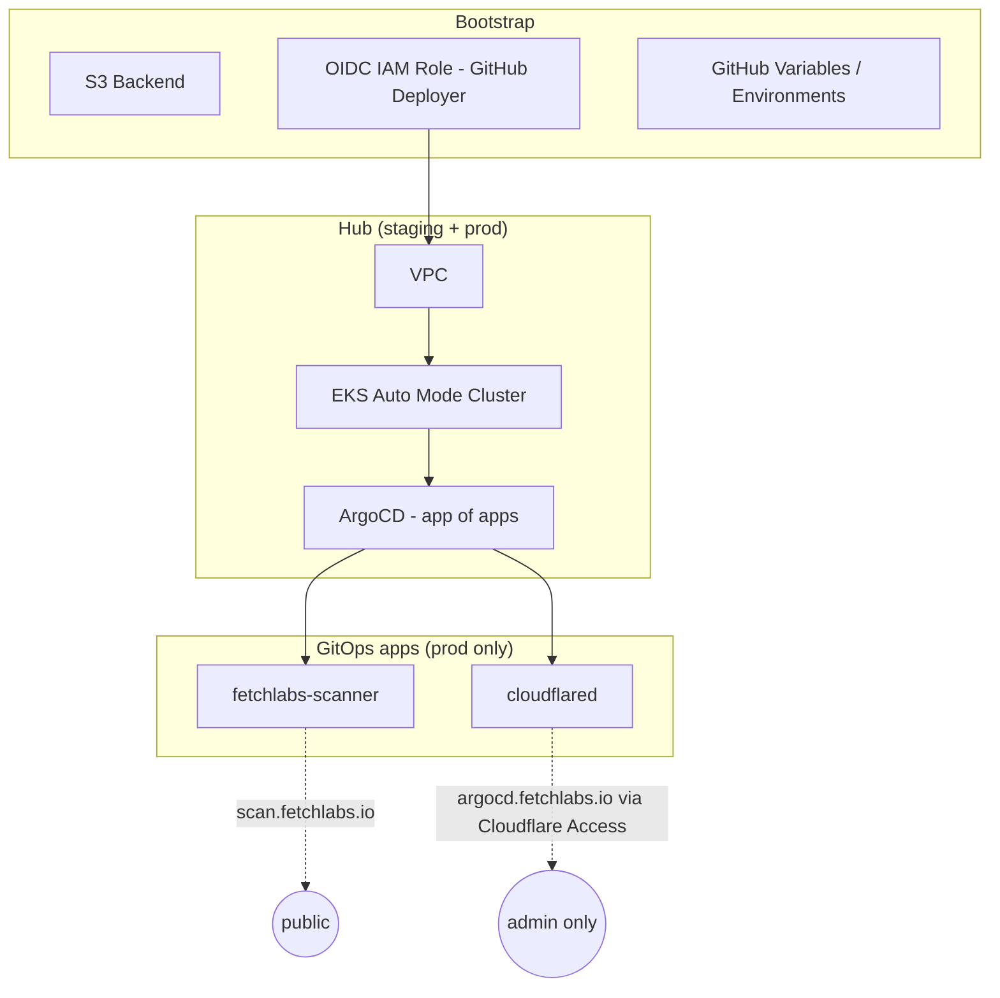

# Edge First Infrastructure (EFI)

[](https://www.terraform.io/)
[](https://aws.amazon.com/)
[](https://about.github.com/)
[](https://kubernetes.io/)
[](https://aws.amazon.com/eks/)

## 📌 Overview

**Edge-First Infrastructure (EFI)** provisions the AWS platform — VPC, an EKS Auto Mode cluster (staging + prod), OIDC-authenticated CI/CD, and GitOps via ArgoCD — behind two live services: the public [fetchlabs-scanner](https://github.com/ehermenau/fetchlabs-scanner) IaC security tool (`scan.fetchlabs.io`) and Cloudflare Zero Trust-gated admin access to ArgoCD itself (`argocd.fetchlabs.io`).

<details>
<summary>View Architecture Diagram</summary>


```mermaid
graph TB

    subgraph "Bootstrap"
        direction LR
        A[S3 Backend]
        B[OIDC IAM Role - GitHub Deployer]
        J["GitHub Variables / Environments"]
    end

    subgraph "Hub (staging + prod)"
        B --> C[VPC]
        C --> D[EKS Auto Mode Cluster]
        D --> E[ArgoCD - app of apps]
    end

    subgraph "GitOps apps (prod only)"
        E --> F[fetchlabs-scanner]
        E --> G[cloudflared]
    end

    F -.->|scan.fetchlabs.io| K((public))
    G -.->|argocd.fetchlabs.io via Cloudflare Access| L((admin only))
```

</details>

## 🏗 Architecture

The project is structured into modular Terraform layers, each with its own state and CI plan/apply gating (see Workflow Structure below), plus one GitOps app-of-apps for everything that runs on the cluster.

- **Bootstrap** (`terraform/bootstrap`): S3 backend buckets, OIDC IAM roles, GitHub Actions Variables/Environments. Applied once, separately from everything else.
- **VPC Infra** (`terraform/vpc-infra`): Multi-AZ networking, Route 53 internal zones. Per environment (staging, prod).
- **EKS Infra** (`terraform/eks-infra`): One **EKS Auto Mode** cluster per environment — no separate managed-node-group tier, no edge nodes.
- **Scanner Infra** (`terraform/scanner-infra`): ECR, ALB/ACM, and DNS for the scanner service. Prod only — see the `fetchlabs-scanner` section below.
- **ArgoCD Access** (`terraform/argocd-access`): Cloudflare Tunnel + Access in front of the ArgoCD UI. Prod only — see the ArgoCD UI access section below.
- **GitOps** (`gitops/hub`): ArgoCD app-of-apps (`gitops/hub/root`) that watches `gitops/hub/apps/**/application.yaml` — a new numbered folder there is enough to register a new app, no ArgoCD-side config needed.

---

## 🚀 Workflow Structure

The pipeline implements a **Promotion-Based Deployment** model to protect production stability:

1.  **Verification & Gated Promotion**:
    - Triggered on every push.
      - `tflint` and `terraform validate` for **Staging** and **Prod** environments.
    - Triggered on every pull request.
      - `terraform plan` for **Staging** environment.
    - Triggered on every merge to the main branch.
      - `terraform apply` for **Staging** environment.
      - `terraform plan` & `terraform apply`for **Prod** environment, after Staging succeeds.

    | Environment        | Trigger Event | Action           | Flow                  | Purpose             |
    | :----------------- | :------------ | :--------------- | :-------------------- | :------------------ |
    | **Staging & Prod** | Push          | tflint, validate | Automatic             | Regression Testing  |
    | **Staging**        | Pull Request  | plan             | Automatic             | Active Verification |
    | **Staging**        | Pull to Main  | apply            | Automatic             | Environment Sync    |
    | **Production**     | Pull to Main  | plan & apply     | Once Staging Succeeds | Controlled Release  |

---

## 🔐 Security & Identity

### OIDC Authentication

We utilize **GitHub OIDC** to authenticate with AWS without long-lived credentials. The IAM roles are strictly scoped to the path of the specified git repository.

### Cluster Access

EKS access is managed via **Access Entries**, granting `AmazonEKSClusterAdminPolicy` to:

- **The GitHub Runner IAM Role**: Uses the `AWS_ROLE_ARN` provided by the bootstrap process.
- **Designated Admin ARNs**: Defined via `var.admin_user_arn`.

---

## ✅ Post-Deployment

To interact with the EKS cluster locally after a deployment:

1.  **Update Kubeconfig**:
    ```bash
    aws eks update-kubeconfig --region us-east-1 --name <cluster name>
    ```
2.  **Verify Access**:
    ```bash
    kubectl get nodes
    ```

---

## 🔍 fetchlabs-scanner

`scan.fetchlabs.io` — a public infrastructure security posture scanner ([`fetchlabs-scanner`](https://github.com/ehermenau/fetchlabs-scanner)) — runs on the prod EKS cluster, which is why prod no longer auto-destroys nightly (staging still does). GitOps entry point: `gitops/hub/apps/10-scanner`.

**One-time setup** for a fresh environment:

1. `terraform apply` `terraform/scanner-infra` (prod only — see its `providers.tf` for why this layer isn't per-environment or nightly-destroyed).
2. Copy its `acm_certificate_arn` output into `gitops/hub/apps/10-scanner/manifests/ingress.yaml`, replacing `REPLACE_WITH_ACM_CERTIFICATE_ARN`. One-time because the cert is stable going forward.
3. Set GitHub repo variables/secrets: `CLOUDFLARE_ZONE_ID` (var), `CLOUDFLARE_API_TOKEN` (secret — see the `argocd-access` section below for its full required scope, since `terraform/argocd-access` widens it beyond DNS-edit) — consumed by `terraform/scanner-infra`'s apply and by `scripts/sync-scanner-dns.sh`.
4. Push to `main`. `workflow.yml` applies `scanner-infra`, then `eks_prod` → `argocd_bootstrap_prod` installs ArgoCD, applies the app-of-apps root, and syncs `scan.fetchlabs.io`'s DNS to the ALB once the Ingress gets one.

ALB provisioning note: the ALB is created dynamically by EKS Auto Mode's built-in load balancer controller from the scanner's `Ingress` (not a Terraform `aws_lb` resource). Since staging still nightly-destroys, `auto_destroy.yml` runs a `drain_ingress_staging` job that deletes the Ingress and waits for the controller's finalizer to confirm ALB teardown *before* `terraform destroy` runs on `eks-infra` — otherwise the ALB would be orphaned (no Terraform state tracks it, and the controller pods die before they can clean it up if the cluster goes first).

---

## 🔐 ArgoCD UI access (`argocd.fetchlabs.io`)

ArgoCD's UI has no K8s Ingress and isn't reachable via a `LoadBalancer`/ALB at all — it's fronted by a **Cloudflare Tunnel**, with **Cloudflare Access** gating the hostname to a short allowlist of emails (`terraform/argocd-access`'s `allowed_emails` variable, one-time-PIN login). `cloudflared` makes an outbound-only connection from inside the cluster, so there's no inbound port, security group rule, or ALB for this at all. GitOps entry point: `gitops/hub/apps/09-cloudflared`. Prod only — staging nightly-destroys and persistent access there isn't worth the churn; use `kubectl port-forward svc/argocd-server -n argocd 8080:443` there instead.

**One-time setup** for a fresh environment (do these *before* the first push that touches `terraform/argocd-access`, or its `terraform apply` will fail):

1. Widen the existing `CLOUDFLARE_API_TOKEN`'s permissions (Cloudflare dashboard → My Profile → API Tokens) to add, alongside its existing Zone → DNS → Edit scope on `fetchlabs.io`:
   - Account → Cloudflare Tunnel → Edit
   - Account → Access: Apps and Policies → Edit
2. Set `CLOUDFLARE_ACCOUNT_ID` as a **`prod` environment variable** (not repo-level) — `gh variable set CLOUDFLARE_ACCOUNT_ID --env prod --body <id>`, or Settings → Environments → prod → Variables. Scoped like `CLOUDFLARE_API_TOKEN` (also prod-only), not like `CLOUDFLARE_ZONE_ID` (repo-level today, mostly historical - it's only actually needed by prod-only layers too). Find the account ID via the Cloudflare dashboard sidebar on any zone overview, or `cloudflare accounts list` via the `cloudflare` CLI.
3. Push to `main`. `workflow.yml` applies `terraform/argocd-access` (creates the Tunnel, DNS record, and Access application), then `argocd_bootstrap_prod` creates the `cloudflared-token` Secret from its output and applies the app-of-apps root, which syncs `gitops/hub/apps/09-cloudflared`.
4. Browse to `https://argocd.fetchlabs.io` — Cloudflare Access sends a one-time PIN to whichever address in `allowed_emails` you sign in with. Login method is restricted to One-Time PIN only (added manually once, Zero Trust → Integrations → Identity providers → Add new → One-time PIN) — no other IdP setup required.

---

<details>
<summary>Architectural Decision Records</summary>

## 📜 Architectural Decision Records (ADR)

### ADR 001: Compute Abstraction (Hub vs. Edge)

#### Status: Accepted (2026-02-22)

#### Context:

> We required a compute strategy that balances operational efficiency in the Hub with deep kernel control at the Edge.

#### Decision:

> Management Hub: Implemented using EKS Auto Mode. This offloads the undifferentiated heavy lifting of node scaling, patching, and AMI management to AWS, allowing the focus to remain on global orchestration.

> Edge Nodes: Implement using EKS Managed Node Groups. This provides the necessary access to the underlying Linux kernel required for eBPF (Cilium) and distributed storage (Longhorn) performance tuning.

#### Consequences:

> Reduced operational overhead for the Hub; increased complexity for Edge maintenance is accepted to satisfy security and latency requirements.

#### Amendment (2026-08-05):

> The Edge tier described above was never implemented — no Managed Node Groups, Cilium, or Longhorn exist anywhere in this repo. In practice the project stayed scoped to the Hub: one EKS Auto Mode cluster per environment (staging, prod), nothing else. This amendment records that descope rather than rewriting the original decision — the Hub-only result is what's currently deployed and demoable.

---

</details>
